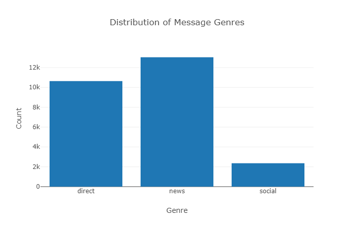
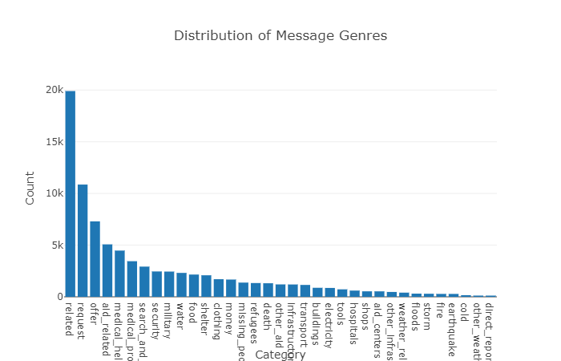

# Disaster Response Pipeline Project

*Disaster Response Pipeline Project* is a Web app that can classify disaster message into specific categories during a disaster event. The app is based on Bow and Random Forest Classifier ML model. The project is part of Data Science Nanodegree Program by Udacity in collaboration with Figure Eight.

## Quick Start
1. Clone or download the repo
2. Open terminal and navigate to the project folder
3. Run ```pip install -r requirements.txt```
4. Run ```python app/run.py ```
5. Go to https://0.0.0.0:3001 or https://localhost:3001

For more instructions please read full instruction below.


## Folder Structures

```
├── README.md          
│
├── models                   <- Trained models and ML pipeline
│   ├── classifier.pkl       <- Saved model
│   └── train_classifier.py  <- Scripts to train model
│
├── requirements.txt         <- File for reproducing the environment
│
├── data                     <- Raw and processed Data; data     
│   │                           cleaning script
│   ├── messages.csv         <- Raw messages data
│   ├── categories.csv       <- Raw categories data
│   ├── DisasterResponse.db  <- Saved processed data
│   └── process_data.py      <- Scripts to process data
│
├── notebooks                <- Jupyter notebooks
│
└── App                      <- Source code for use in this project.
    ├── templates            <- Flask html templates 
    └── run.py               <- Scripts to create start Flask server. 
```

## Full Instructions
- Installation
    Install Python 3.5+
    Run ```pip install -r requirements.txt```
- Prepare data
    1. Clone or download the repo
    2. Open terminal and navigate to the project folder
    3. Run ```python data/process_data.py data/disaster_messages.csv data/disaster_categories.csv data/DisasterResponse.db```
- Train model
    5. Run ```python models/train_classifier.py data/DisasterResponse.db models/classifier.pkl```

- Start Web app
    6. Run ```cd app```
    7. Run ```python run.py```
    8. Open web browser and go to http://loclhost:3001 or http://0.0.0.0:3001

## Screen Shot


--------
